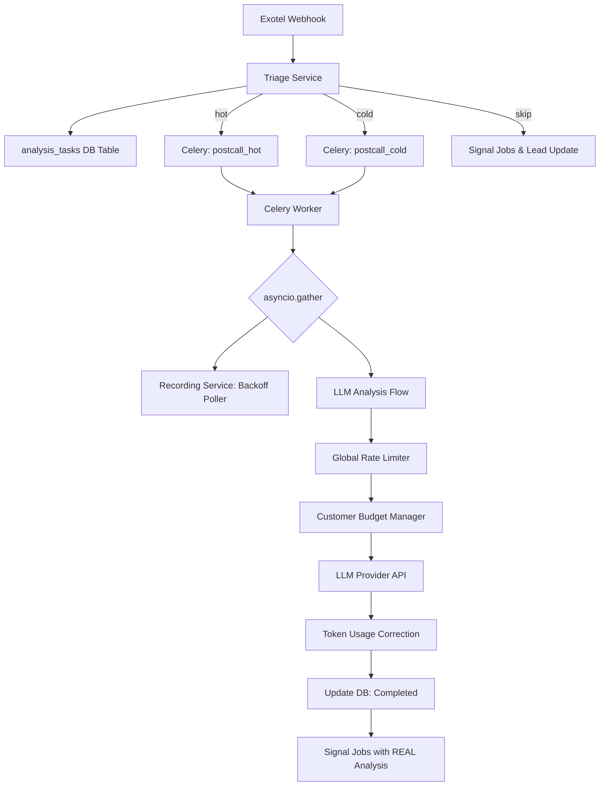

# Post-Call Processing Pipeline — Design Document

**Author:** Srivignesh M
**Date:** 2026-05-06

---

## 1. Assumptions

1. **Exotel Reliability:** Exotel correctly emits webhooks upon call termination. Recording URLs eventually become available (typically within 120s).
2. **LLM Costing:** Token usage is the primary cost driver and scaling bottleneck. Requests per Minute (RPM) is secondary but also enforced.
3. **Connectivity:** Redis and Postgres are highly available and durable. Redis is used for real-time counters, Postgres for authoritative state.
4. **Data Sensitivity:** Transcripts contain PII. S3 and DB access must be scoped.
5. **Backpressure:** The dialler can receive and act upon `rate_factor` signals to pace outbound calls.

---

## 2. Problem Diagnosis

The legacy system was a **synchronous-blocking fire-and-forget** pipeline. 
- **Scale Failure:** It used `asyncio.sleep(45s)` to wait for recordings, pinning worker resources.
- **Reliability Failure:** State lived only in memory or fragile Redis tasks; if a worker crashed, the analysis was lost.
- **Budget Failure:** It was "rate-limit blind," leading to 429 errors from LLM providers which were handled by a blunt "freeze all dialling" circuit breaker.
- **Fairness Failure:** No per-customer budgets meant one large campaign could starve all other customers on the platform.

---

## 3. Architecture Overview



### Key design decisions

1. **Durable Task Tracking:** Every interaction is written to an `analysis_tasks` table *before* enqueueing. This ensures no loss on worker restarts.
2. **Dual-Priority Queuing:** Hot interactions (rebooks/demos) are routed to a dedicated high-priority queue to ensure low latency even during cold-queue backlogs.
3. **Decoupled Recording Fetch:** Replaced the 45s sleep with a parallel backoff poller. Recording status is independent of LLM status.
4. **Proactive Rate Limiting:** Enforced via Redis Lua scripts *before* calls are made, preventing 429s.
5. **Fair-Share Budgeting:** Implemented per-customer token buckets with guaranteed floors and opportunistic bursting.

---

## 4. Rate Limit Management

### How you track rate limit usage
Usage is tracked using **Redis sliding-window counters** (60s window). We track both TPM (Tokens Per Minute) and RPM (Requests Per Minute) globally. We use Lua scripts for atomic `read-increment-expire` operations to prevent race conditions during concurrent bursts.

### How you decide what to process now vs. defer
1. **Global Check:** If platform TPM/RPM limits are reached, the task is deferred.
2. **Lane Priority:** `postcall_hot` tasks are prioritized. `postcall_cold` tasks are deferred first under pressure.
3. **Triage:** Short calls (<4 turns) are skip-laned entirely, consuming 0 tokens.

### What happens when the limit is hit (recovery, not crash)
The `PostCallProcessor` raises a `RateLimitExceeded` exception containing a `wait_seconds` hint (derived from Redis TTL or LLM `Retry-After`). Celery catches this and re-enqueues the task with a `countdown`, effectively pausing that interaction until capacity recovers.

---

## 5. Per-Customer Token Budgeting

- **Allocation:** Each customer has an `allocated_tpm` (guaranteed floor) in the `customer_quotas` table.
- **Guarantees:** A customer's floor is always available. Even if the platform is at 90% capacity, Customer A's reserved tokens are not given to Customer B.
- **Bursting:** If global utilization is low (<70%), customers can burst up to `allocated_tpm * burst_factor`.
- **Headroom:** Unallocated headroom (Global Limit - Sum of Floors) is distributed fairly among active customers requesting burst capacity.

---

## 6. Differentiated Processing

We use a **Call Triage Service** that runs immediately upon webhook receipt.
- **Mechanism:** Synchronous keyword-based classification (zero cost, zero I/O).
- **Justification:** It allows immediate routing decisions. High-value calls (mentions of "confirm", "book", "demo") go to the `hot` queue. Low-value/negative calls (mentions of "not interested", "wrong number") go to `cold`. Short calls are skipped. This ensures high-intent leads are never delayed by a backlog of "wrong numbers."

---

## 7. Recording Pipeline

Replaced `asyncio.sleep(45s)` with a **5-attempt exponential backoff poller** (10s, 15s, 20s, 30s, 45s).
- **Functionality:** Polls Exotel for the URL. Once ready, downloads and uploads to S3 in parallel with LLM analysis.
- **Observability:** Every failure emits a structured log with `alert=True`. Recording status is durably tracked in `analysis_tasks.recording_status` (pending/uploaded/failed/skipped).

---

## 8. Reliability & Durability

The system uses **Postgres as the source of truth for task state**.
1. Webhook writes `analysis_tasks` row (`status='queued'`).
2. Worker updates status to `processing`.
3. Worker updates status to `completed` or `failed`.
4. A separate **Sweeper Job** (reconciliation) scans for tasks stuck in `processing` for >10 mins or `queued` but not enqueued in Celery, and restarts them.

---

## 9. Auditability & Observability

### What you log (and what fields every log event includes)
Every log event includes:
- `interaction_id`
- `correlation_id` (generated at webhook entry)
- `customer_id`
- `campaign_id`
- `lane` (hot/cold/skip)

### Alert conditions
1. **Critical:** `llm_utilisation_critical` (>95% usage).
2. **Warning:** `recording_poll_exhausted` (recording lost after 120s).
3. **Error:** `postcall_failed_permanently` (max Celery retries exhausted).
4. **Throttle:** `dialler_backpressure_halt` (Dialler stopped due to platform load).

---

## 10. Data Model

```sql
-- Durable task tracker
CREATE TABLE analysis_tasks (
    id UUID PRIMARY KEY DEFAULT uuid_generate_v4(),
    interaction_id UUID NOT NULL REFERENCES interactions(id),
    customer_id UUID NOT NULL,
    lane VARCHAR(10) NOT NULL DEFAULT 'cold',
    status VARCHAR(20) NOT NULL DEFAULT 'queued',
    celery_task_id VARCHAR(255),
    attempt_count INTEGER DEFAULT 0,
    next_retry_at TIMESTAMPTZ,
    tokens_used INTEGER DEFAULT 0,
    correlation_id UUID NOT NULL,
    recording_status VARCHAR(20) DEFAULT 'pending',
    recording_s3_key VARCHAR(512),
    created_at TIMESTAMPTZ DEFAULT NOW(),
    updated_at TIMESTAMPTZ DEFAULT NOW()
);

-- Per-customer budget config
CREATE TABLE customer_quotas (
    customer_id UUID PRIMARY KEY,
    allocated_tpm INTEGER NOT NULL DEFAULT 1000,
    burst_factor FLOAT NOT NULL DEFAULT 1.5,
    daily_token_limit BIGINT,
    priority_tier INTEGER DEFAULT 2
);

-- End-to-end audit log
CREATE TABLE interaction_audit_log (
    id BIGSERIAL PRIMARY KEY,
    interaction_id UUID NOT NULL REFERENCES interactions(id),
    correlation_id UUID NOT NULL,
    stage VARCHAR(50) NOT NULL, -- triage, llm_call, recording_poll
    status VARCHAR(20) NOT NULL, -- started, completed, failed
    metadata JSONB DEFAULT '{}',
    duration_ms INTEGER,
    created_at TIMESTAMPTZ DEFAULT NOW()
);
```

---

## 11. Security

- **In Transit:** All API calls (Exotel, LLM, CRM) use HTTPS.
- **At Rest:** Transcripts in Postgres are stored in JSONB. Transcripts in recordings (S3) are private, accessible only via signed URLs or VPC-internal access.
- **Budgeting:** Per-customer quotas prevent "Resource Exhaustion" attacks where one customer drains the entire platform budget.

---

## 12. API Interface

The `POST /session/.../interaction/.../end` contract was **maintained** for compatibility with Exotel webhooks. 
- **Internal change:** It now generates a `correlation_id` and returns it in the response for debugging.
- **Logic change:** It no longer triggers signal jobs immediately. It only triages and enqueues.

---

## 13. Trade-offs & Alternatives Considered

| Option | Why Considered | Why Rejected / What You Chose Instead |
|--------|---------------|--------------------------------------|
| RabbitMQ Priority | Native priority support | Stuck with Redis for Celery to minimize infra changes; simulated via dual-queues. |
| LLM-based Triage | More accurate than keywords | Too expensive at 100K calls. Keyword triage is free and "good enough" to split hot/cold. |
| Synchronous Recording | Simpler code | Rejected because it blocks workers. Async parallel fetch is 10x more efficient. |

---

## 14. Known Weaknesses

1. **Race Conditions:** If a worker crashes *exactly* between S3 upload and DB status update, the file is orphaned in S3.
2. **Keyword Accuracy:** Hinglish or ambiguous transcripts may land in the `cold` lane incorrectly.
3. **Redis Dependency:** The rate limiter depends on Redis. If Redis dies, the platform defaults to "unlimited," risking 429s.

---

## 15. What I Would Do With More Time

1. **LLM-assisted Triage:** For ambiguous keywords, use a tiny (GPT-4o-mini / Haiku) model to triage for 5% of the cost.
2. **Nightly Reconciliation:** A script to find orphaned S3 recordings or stuck DB tasks and auto-repair.
3. **Usage Dashboard:** A real-time Grafana dashboard using the `interaction_audit_log` to show TPM/RPM per customer.
4. **Streaming Analysis:** Start analysis while the call is still active (Pre-Post-Call) for ultra-low latency.
